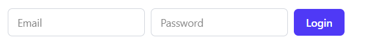

# Installation Guide

Complete guide to self-host PacketMeter.

## Prerequisites

- Node.js 18+
- PostgreSQL *(or SQLite if you prefer a lightweight, self-hosted setup without the overhead of PostgreSQL)*
- Docker

## 1. Clone Repository

```bash
git clone https://github.com/mohyware/PacketMeter.git
cd PacketMeter
```

## 2. Configure Environment (.env)
All required configuration variables are located in the server/.env

- Required (for login)

  - **TEST_USER_EMAIL** – the email you will use to sign in.
  - **TEST_USER_PASSWORD** – the password for the seeded test account.

  These values are used when seeding the database to create your first login account.

- Optional

  - **Mail configuration** – update if you want the system to send email reports.
  - **Database** – SQLite is the default option.
## 3. Server Setup

```bash
cd server

# Install dependencies
npm install

# Rename .env.example to .env and add your configurations:
```

### Initialize Database

```bash
# Create database (only for postgresql)
createdb packetmeter 

# Run migrations
npm run db:push

# Seed (creates a "Premier" plan and subscribes to it, and also creates an account)
npm run db:seed
```

### Start Server

```bash
# Development
npm run dev

# Production
npm run build
npm start
```

## 4. Web Dashboard Setup

```bash
cd web

# Install dependencies
npm install

# Rename .env.example to .env and add your configurations:

# Build & Serve
# Development
npm run dev

# Production build
npm run build
```
## 5. Login
You can now navigate to **http://localhost:3000** and sign in using the **TEST_USER_EMAIL** and **TEST_USER_PASSWORD** you configured in the server `.env`.




## 6. Clients Setup
You can either download the ready releases or build from source.  
Check each service's README for detailed instructions on building from source.

### Linux Daemon

See [Linux Daemon README](./client-pc/daemon-linux/README.md) for installation instructions.

### Windows Service

See [Windows Daemon README](./client-pc/daemon-win/README.md) for installation instructions.

### Android App

See [Client Phone README](./client-phone/README.md) for installation instructions.

## 7. Docker Deployment

### Start Services

```bash
docker-compose up -d
```

## Support

For additional help, please open an issue on GitHub.
