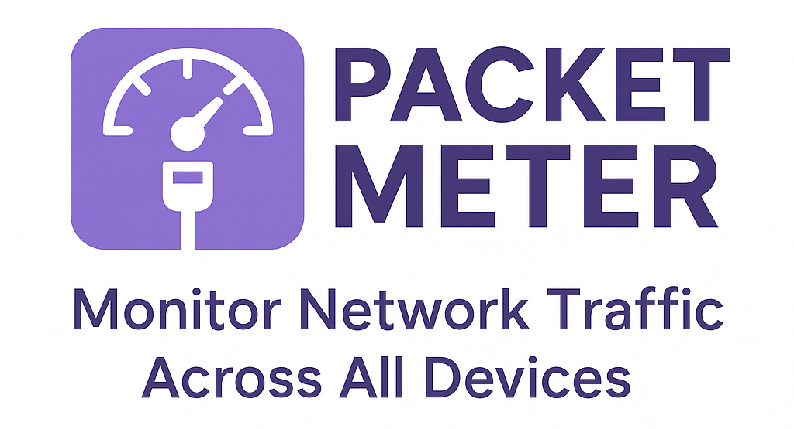
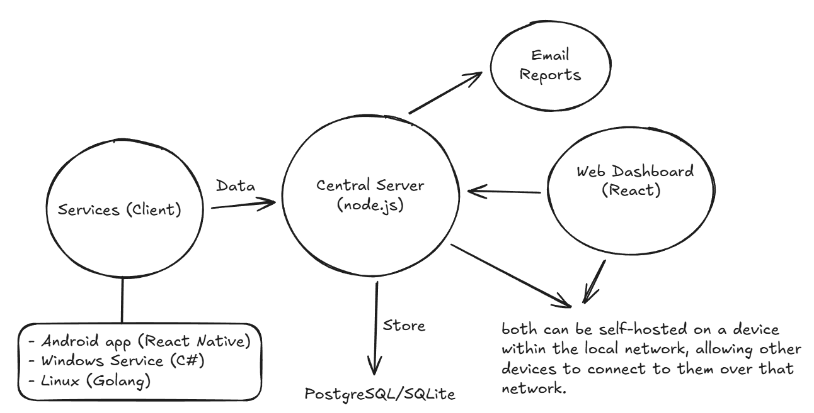
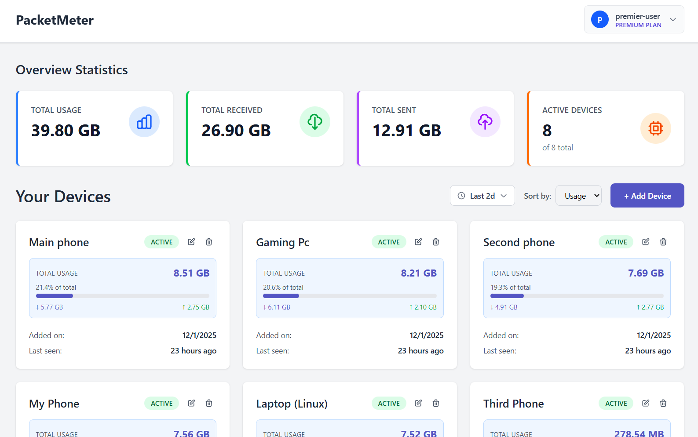
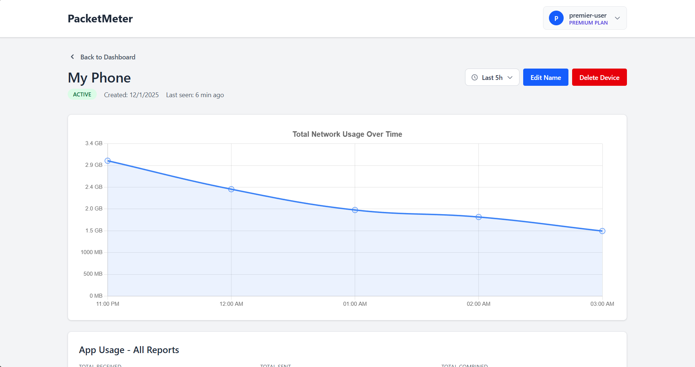
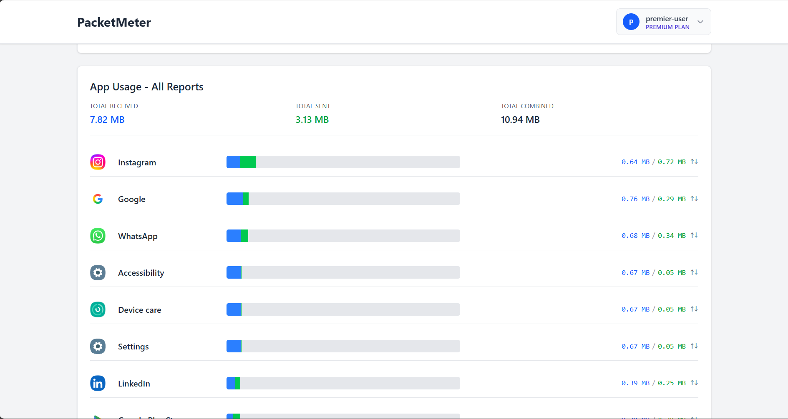

# Packet Meter

> Cross-platform network traffic monitoring system that can be self-hosted easily.

<!--  -->

## Features

- 📱 **Multi-Device Support** - Monitor Windows, Linux, and Android devices from one dashboard
- 📊 **Real-Time Analytics** - Track network usage per device and per application
- 📧 **Email Reports** - Automated daily/weekly usage reports delivered to your inbox
- 🔒 **Self-Hosted** - Full control over your data with complete privacy
- 🎯 **Per-App Monitoring** - See exactly which apps consume your bandwidth
- 📈 **Historical Data** - Track usage patterns over time with detailed charts

## Preview

### Dashboard

<table width="100%">
  <tr>
    <td width="50%">
      
    </td>
    <td width="50%">
      
    </td>
  </tr>
</table>

### Mobile App

<table>
  <tr>
    <td></td>
    <td></td>
    <td></td>
    <td></td>
  </tr>
</table>

<!-- ### Email Reports
 -->

## Self-Hosting

Want to host PacketMeter yourself? Check out [Installation Guide](./INSTALLATION_GUIDE.md) for detailed setup instructions.

## TODOs & Contributions
Prioritized tasks are listed in [TODO.md](./TODO.md). 

Contributions are welcome! If you encounter issues or have questions, please open an issue on GitHub.

## License

Apache License - see [LICENSE](LICENSE) file for details.