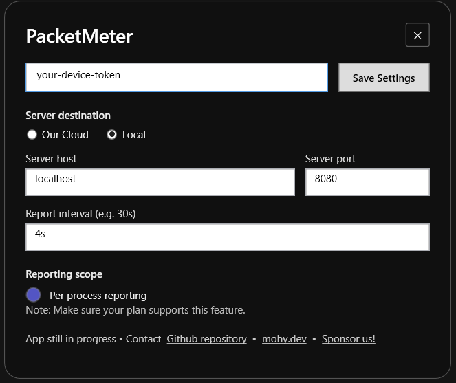

## Windows Service
PacketMeter’s Windows daemon uses ETW network sessions to capture per-process network usage, reports metrics back to the central PacketMeter server, and provides a simple UI for control.



---
### Prerequisites
- Windows 10 or 11 (x64)
- .NET 9.0 SDK
- WiX Toolset build tools (via `dotnet tool restore` from the repo root)

---
### Build & Package
Publish both applications and then build the MSI installer:
```bash
cd client-pc/daemon-win
dotnet publish Daemon -c Release
dotnet publish UI -c Release

cd Installer
dotnet build
```
You should see the output at `client-pc/daemon-win/Installer/bin\x64\Debug\PacketMeter.msi`.