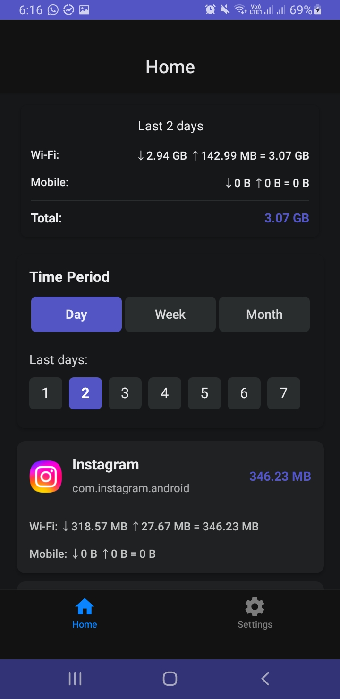
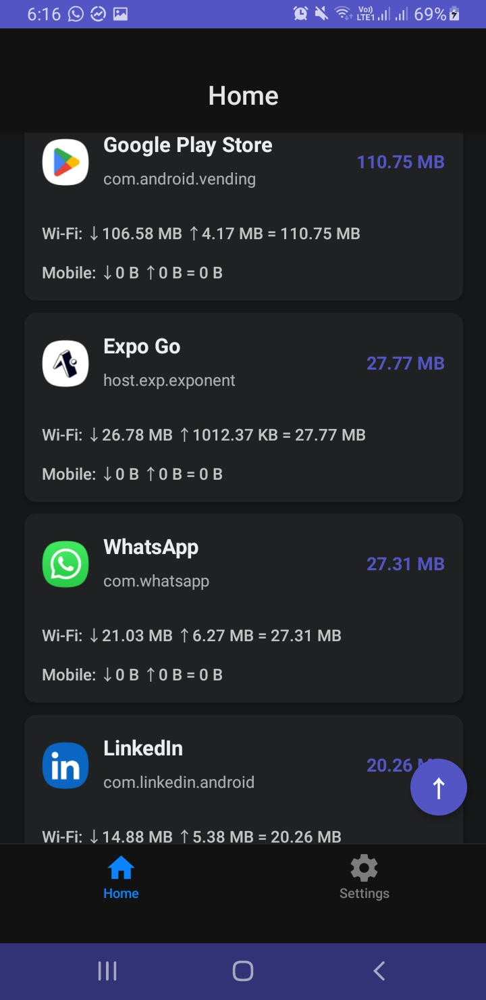
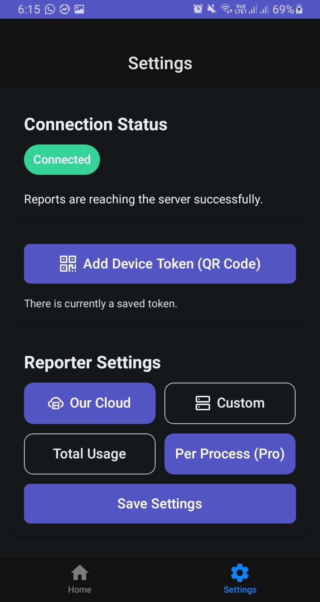
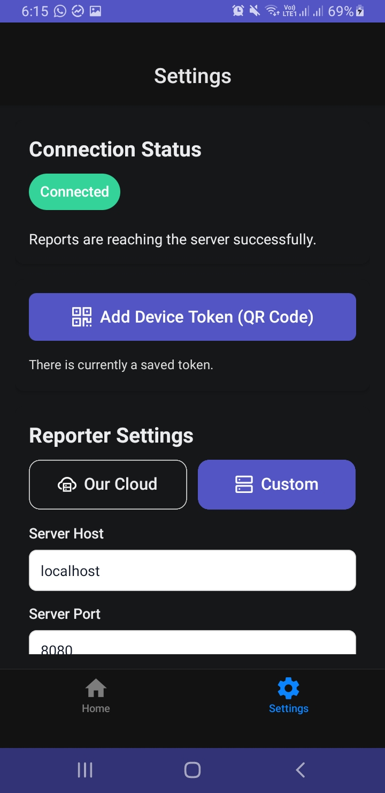

# Packet Meter (Phone Client)

Mobile app built with React Native and Expo that monitors network traffic usage using Android's `NetworkStatsManager` API. The app tracks per-app and total network usage, reporting data to a central server via background tasks.

Currently, the data is stored daily, not hourly, because this API doesn’t provide real-time usage. I’m still exploring ways to get real-time usage data, similar to how apps like GlassWire do for example.

<table>
  <tr>
    <td></td>
    <td></td>
    <td></td>
    <td></td>
  </tr>
</table>

## Prerequisites

- Node.js (v18 or higher)
- Android Studio with Android SDK
- Expo CLI (`npm install -g expo-cli`)
- Android device or emulator

## Build Android APK

```bash
# Install JS dependencies
npm install

# Build and install
cd android
./gradlew assembleDebug      # For development
./gradlew assembleRelease    # For production
```

You should see the output at:

```bash
android/app/build/outputs/apk/debug/
android/app/build/outputs/apk/release/
```
